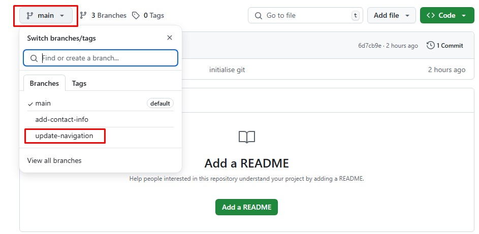

## Project Title: Collaborative Feature Integration with Git and GitHub

### Overview
This project demonstrates how to collaborate effectively using Git and GitHub by integrating individual feature branches into a central `main` branch using **Pull Requests (PRs)**. The simulation involves two contributors, Tom and Jerry, working on separate branches and eventually merging their work into the main project.

---

## Objectives

- Simulate collaborative development using Git and GitHub
- Use Pull Requests to review, merge, and manage contributions
- Demonstrate how to keep feature branches updated with the main branch
- Ensure conflict-free integration of code changes

---

## Prerequisites

- Git installed on your local machine
- A GitHub account with a repository set up
- Terminal/Command line access
- Basic knowledge of Git and GitHub operations

---

## Project Workflow

### 🔀 1. Creating and Managing Feature Branches

- Each contributor (Tom and Jerry) created a separate branch from `main`:
  - Tom: `update-navigation`
  - Jerry: `add-contact-info`
- The contributors made their respective changes locally on these branches.

### Switch to the Branch 
- Each contributor had to switch from the `main` branch to their respective feature branch in order to make updates and push them for review.

---

### 🔁 2. Pushing Changes to GitHub

Each contributor pushed their local branches to GitHub using:

```bash
git push origin <branch-name>
```

Tom run:

```bash
git push origin update-navigation
```

Jerry run:

```bash
git push origin add-contact-info
```

---

### 📬 3. Creating a Pull Request (PR)

**For Tom's Changes:**

1. Navigate to the repository on GitHub.
2. Switch to Tom's branch (`update-navigation`).
3. Click the **"New pull request"** button.
4. GitHub auto-selects `main` as the base and `update-navigation` as the compare branch.
5. Review the changes to ensure correctness.
6. Add a concise **title** and **description** (e.g., “The index.html file contains a sentence describing the purpose of the file.”).
7. Click **“Create pull request”** to submit.

---

### ✅ 4. Reviewing and Merging Tom's Pull Request

- Team members reviewed Tom’s PR.
- Once approved, it was merged into the `main` branch.
- This completed Tom’s contribution to the central project.

---

### 🔄 5. Updating Jerry’s Branch with Latest Changes

Before merging Jerry’s branch (`add-contact-info`), it was necessary to sync it with the latest version of `main` (which now includes Tom’s updates):

```bash
# Switch to Jerry's branch
git checkout add-contact-info

# Pull the latest main branch updates
git pull origin main
```

This step ensured that Jerry’s work was based on the most recent version of the project and prevented potential merge conflicts.

---

### 📤 6. Finalizing Jerry’s Contribution

After updating his branch:

1. Jerry pushed his branch to GitHub:

```bash
git push origin add-contact-info
```

2. Then, he created a **Pull Request** just like Tom did.
3. The PR was reviewed and merged into the `main` branch.

---

## 🧠 Key Learnings

- **Pull Requests** are vital for code reviews and collaborative development.
- Keeping branches **in sync** with the main branch prevents merge conflicts.
- GitHub provides a visual interface to compare changes, comment, and manage PRs efficiently.
- Proper use of branches allows team members to work independently without blocking each other.

---

## 📌 Final Notes

This project exemplifies how Git enables multiple contributors to work concurrently on different features while maintaining a clean and conflict-free integration path. Using branches and pull requests ensures code quality, traceability, and smooth collaboration.
